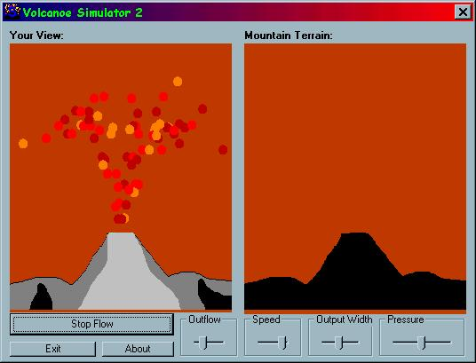

## Volcanoe Simulator 2

### Description

as same as before but you can set the values such as the lava flow width, pressure, and ammount, plus you can set the speed of the animation. hope you like it (love it) and please vote...
 
### More Info
 

             |
---                |---
**Submitted On**   |2002-03-25 17:20:10
**By**             |[poop\_4\_brains](https://github.com/Planet-Source-Code/PSCIndex/blob/master/ByAuthor/poop-4-brains.md)
**Level**          |Beginner
**User Rating**    |5.0 (25 globes from 5 users)
**Compatibility**  |VB 6\.0
**Category**       |[Coding Standards](https://github.com/Planet-Source-Code/PSCIndex/blob/master/ByCategory/coding-standards__1-43.md)
**World**          |[Visual Basic](https://github.com/Planet-Source-Code/PSCIndex/blob/master/ByWorld/visual-basic.md)
**Archive File**   |[Volcanoe\_S653283252002\.zip](https://github.com/Planet-Source-Code/poop-4-brains-volcanoe-simulator-2__1-33057/archive/master.zip)

